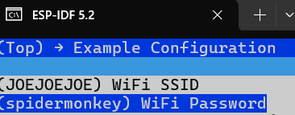
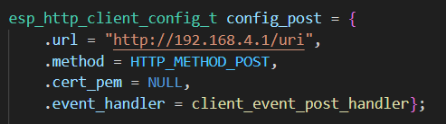

# ESP32-S3-DeviceKitC-1 Demo

## Wi-Fi / UDP requests example

This small program demonstrates how to use Wi-Fi to connect to an access point, generate random sensor values, and send them to a server using the UDP protocol.

## Usage 

- Import the project  

- Configure Wi-Fi SSID and password using `idf.py menuconfig` you also need to configure server information (IP address and PORT)  

- Build the project and flash it to the board

## Output example

  

## Additional Information

- Ensure you have the necessary dependencies installed, such as the ESP-IDF development environment  

- To visualize the sensor data being sent, consider setting up a simple UDP server that logs incoming data  

- For troubleshooting and debugging, use the ESP_LOGI function to log key events and data points in the code  

- This example can be extended to include more complex sensor data generation or additional types of sensors as needed  